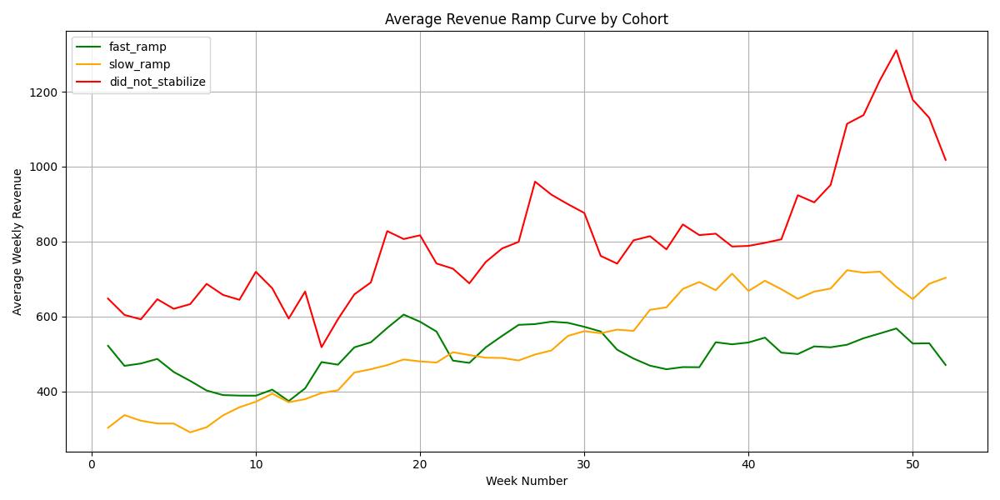

# Olist E-Commerce Data — Seller Ramp Analysis | The Tortoise vs The Hare

## Description

Olist is a Brazilian e-commerce platform that connects small and medium-sized businesses to major online marketplaces. Sellers list their products on Olist, which automatically publishes those listings across marketplaces. When products are ordered, Sellers can leverage Olist's logistics partners for fulfillment. Kaggle offers a free dataset containing anonymized real order, seller, and product data from 2016–2018.

Inspired by my experience analyzing new vendor ramp time at Amazon, I wanted to understand how long it took new Sellers on Olist to reach a steady state of sales. I defined steady state as the point where a Seller's week-over-week sales change stays below 10% for two consecutive weeks — the logic being that consecutive weeks of low volatility signal that the Seller has found their rhythm.

This analysis answers three questions:

1. On average, how many weeks did it take new Sellers to reach a steady state of sales?
2. Who performs better long term — Sellers who ramp quickly (the hares) or those who ramp slowly (the tortoises)?
3. How do Olist Sellers' ramp times compare to what I observed working with new vendors at Amazon?

---

## Dataset

**Brazilian E-Commerce Public Dataset by Olist** — https://www.kaggle.com/datasets/olistbr/brazilian-ecommerce

The Olist data is divided into 8 datasets and this project uses 3:
- `olist_orders_dataset` — the core dataset that connects all other tables
- `olist_order_items_dataset` — item-level data for each order including price and freight value
- `olist_sellers_dataset` — data on the seller who fulfilled each order

---

## Approach

**`load_data.py`** — a data pipeline that reads the three raw CSVs into memory with pandas and loads them into a local Postgres database as structured tables using SQLAlchemy.

**`queries.sql`** — three SQL queries that build toward the final analysis:

- *Query 1* establishes a baseline — each seller's first sale, last sale, and total orders using `MIN`, `MAX`, and `COUNT` joined across the orders and order items tables.
- *Query 2* calculates weekly revenue per seller indexed to their launch date. Days elapsed since first order are divided by 7 and floored to produce a relative week number. Price and freight value are summed per seller per week.
- *Query 3* is the core analysis, built as a chain of four CTEs. `weekly` replicates the Query 2 logic. `wow` adds week-over-week percent change using the `LAG()` window function partitioned by seller. `steady` uses `LEAD()` to identify the first two consecutive weeks where absolute WoW change is below 10% and week numbers are exactly one apart. `cohorts` applies a `CASE` statement to label each seller as `fast_ramp` (steady state by week 16), `slow_ramp` (weeks 17–52), or `did_not_stabilize`.

**`visualize.py`** — connects to Postgres, pulls the Query 3 result into a pandas DataFrame, filters to sellers who joined before July 2017 and average at least $200 in weekly revenue, groups by cohort and week number, applies a 4-week rolling average to smooth volatility, and plots three ramp curves — one per cohort.

---

## Findings

The average time for a new Olist Seller to reach a steady state of sales was **29.8 weeks**.

Contrary to what the tortoise and the hare might suggest, slow ramp Sellers ultimately outperformed fast ramp Sellers in long-term revenue. Fast ramp Sellers plateaued early at a lower revenue ceiling while slow ramp Sellers continued growing. The did not stabilize cohort generated the highest revenue but with the most volatility — these appear to be high-volume Sellers whose sales are driven by seasonality or promotions rather than consistent demand.

Compared to my experience with new vendor ramp at Amazon, 29.8 weeks aligns directionally with what I observed — which makes sense given this analysis focuses on serious, high-volume sellers rather than the full Olist seller population.



---

## How to Run

1. Download the following 3 datasets from Kaggle and save them to a `/data` folder in the project root:
   - `olist_orders_dataset.csv`
   - `olist_order_items_dataset.csv`
   - `olist_sellers_dataset.csv`

   Dataset: https://www.kaggle.com/datasets/olistbr/brazilian-ecommerce

2. Clone this repo and navigate to the project folder

3. Create a virtual environment and install dependencies:
```
   pip install -r requirements.txt
```

4. Create a local Postgres database named `olist`:
```
   psql postgres
   CREATE DATABASE olist;
```

5. Run the data pipeline:
```
   python load_data.py
```

6. Run the visualization:
```
   python visualize.py
```